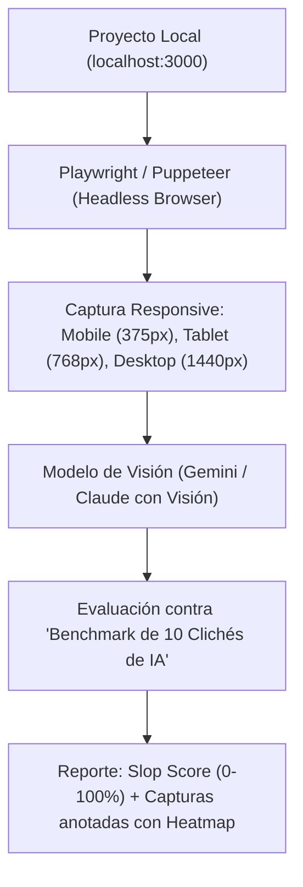

# Bot Detector de UI Slop — Documento de Contexto

> **Origen:** Este documento sintetiza la charla y el archivo conceptual original de Obsidian `AntigravityBrain/02_Aprendizajes/bot-detector-ui-slop.md` (2026-09-17) + hallazgos de las conversaciones de Antigravity en `.gemini/antigravity/conversations` (653 DBs, análisis con veredicto *High AI Slop*).  
> **Objetivo:** Dejar trazabilidad completa para el desarrollo del MVP del bot auditor de interfaces generadas por IA.

---

## 1. Contexto: ¿Por qué existe este proyecto?

Las herramientas de generación de UI por IA (v0.dev, Bolt.new, Lovable, Cursor, etc.) democratizaron el frontend, pero introdujeron un problema sistémico: **todas las interfaces se ven iguales**. La optimización por "parecer moderno" llevó a un mínimo común denominador estético — gradientes violeta, cards con blur, tipografía sin ritmo — que el autor del doc original bautizó como **UI Slop**.

Este repo nace para **detectar, medir y corregir** ese slop de forma automática, no desde el código, sino desde lo que ve el usuario final.

---

## 2. ¿Qué es el UI Slop?

Definición original (`bot-detector-ui-slop.md:13-19`):

El **UI Slop** es la degradación estética y funcional que ocurre cuando las IAs generan interfaces por defecto. Se caracteriza por:

1.  **Diseños estériles e intercambiables:** Todas las webs parecen la misma plantilla SaaS genérica. Sin identidad de marca.
2.  **Uso abusivo de gradientes violetas/índigo** (`from-violet-500 to-indigo-600`) y destellos para simular "modernidad" sin justificación.
3.  **Encabezados centrados con textos corporativos vacíos:** *"Empower your workflow with AI"*, *"Unlock your potential"*, *"The future is here"*.
4.  **Falta de ritmo visual:** Sin jerarquía tipográfica real, sin micro-interacciones, sin estados vacíos/error bien diseñados. Mucho espacio negativo muerto.
5.  **Patrones cliché detectados en Antigravity** (ver `0ed76dea...db:622`): `bg-white/70`, `backdrop-blur-xl`, `rounded-2xl/rounded-full`, `shadow-xl shadow-zinc-200/50`, animaciones cinemáticas de 700ms que priorizan "flash over function".

> **Veredicto observado en conversaciones Antigravity:** `High AI Slop` — glassmorphism excesivo, transparencia superpuesta, baja legibilidad (`text-amber-700/70` sobre gradientes), arquitectura de información saturada (dashboard con `FreeGamesWidget` + `DailySummary` + `EventAlerts` sin priorización).

---

## 3. El Talón de Aquiles de Impeccable

**Impeccable (`impeccable.style`)** es el referente actual. Su enfoque: análisis estático de código (AST, clases Tailwind, JSX/HTML) + sugerencias de texto en terminal/skills.

| Aspecto | Impeccable | UI Slop Bot (Propuesta) |
| :--- | :--- | :--- |
| **Fuente de análisis** | Código estático | **Píxeles renderizados** (screenshots reales) |
| **Punto ciego** | No ve colisiones visuales, roturas en 375px, contraste real, ni blur mal aplicado | Evalúa exactamente lo que ve el humano en pantalla |
| **Feedback** | Texto en terminal | **Heatmap visual** con recuadros rojos + Slop Score 0-100% + capturas anotadas |
| **Falsos negativos** | Un gradiente en CSS puede no ser visible, pero lo marca igual | Solo penaliza lo que realmente genera ruido visual |

> [!IMPORTANT]
> **La clave competitiva (`bot-detector-ui-slop.md:33-34`):** No competir analizando código. La ventaja es evaluar el **resultado renderizado** con modelos multimodales de visión (Gemini / Claude Vision).

---

## 4. Arquitectura del MVP

Diagrama original (`bot-detector-ui-slop.md:40-47`):



### 4.1 Componentes

1.  **Runner de Navegador (Headless):** Levanta la app local (detecta `next dev`, `vite`, etc.), simula interacción básica (scroll, hover en botones, apertura de menús/drawers) y toma screenshots. Debe manejar `hydration` y `loading skeletons`.
2.  **Extractor de Contexto Computado:** Extrae del DOM renderizado: fuentes tipográficas cargadas, paleta activa, `computedStyle` de contrastes, y estructura de headings. No para decidir, sino para dar contexto al modelo de visión.
3.  **Motor de Inferencia de Visión:** Core del sistema. Prompt calibrado que analiza las 3 imágenes contra el benchmark de clichés. Debe devolver JSON estructurado: `{ score, verdict, issues: [{type, bbox, severity, fix}] }`.
4.  **Visual Reporter:** Genera reporte local (HTML o imágenes anotadas). Dibuja bounding boxes rojas sobre los screenshots y lista de fixes priorizados ("cómo romper el molde").

### 4.2 Los 10 Clichés de IA (Benchmark)

Extraídos de `bot-detector-ui-slop.md:52-56` + conversaciones Antigravity:

1.  Gradientes/destellos púrpuras sin justificación de marca
2.  3 tarjetas de precios con la central flotando + badge "Popular"
3.  Hero con tipografía monótona + excesivo espacio negativo muerto
4.  Textos de relleno genéricos sin propuesta de valor
5.  Glassmorphism abusivo (`backdrop-blur-xl` + `bg-white/70`)
6.  Rounded corners extremos (`rounded-2xl`, `rounded-full` everywhere)
7.  Sombras gratuitas (`shadow-xl`) para simular profundidad
8.  Animaciones de entrada lentas (700ms fade/slide) que cansan al 3er uso
9.  Baja legibilidad por opacidad (`opacity-50`, `text-*/70` sobre gradientes)
10. Falta de estados reales (empty, error, loading) — todo es happy path

---

## 5. Desafíos y Trade-offs Reales

Documentados en `bot-detector-ui-slop.md:61-65`:

*   **Latencia:** Linter estático: 1-2s. Este bot: **10-25s** (compilar frontend + abrir browser + 3 screenshots + inferencia). Mitigación: cache, correr solo en `pre-push` o CI, no en cada save.
*   **Costo de Inferencia:** 3-4 imágenes HD a Gemini/Claude Vision = centavos por corrida (~$0.02-0.05 con Flash). Nada para uso individual, a escalar considerar batch y resize a 1024px.
*   **Calibración de Subjetividad:** El riesgo mayor. Un minimalismo legítimo (ej. Linear, Stripe) puede ser confundido con "pereza de IA". Requiere prompt con ejemplos negativos/positivos y `few-shot` con capturas etiquetadas. Las conversaciones Antigravity ya muestran la rúbrica: `AI slop verdict, heuristic scores (Nielsen 0-4), cognitive load, emotional journey, strengths, priority issues`.

---

## 6. Evidencia en AntigravityBrain y Conversaciones

*   **Obsidian:** `C:\Users\USER\Documents\AntigravityBrain\02_Aprendizajes\bot-detector-ui-slop.md` — 65 líneas, tags `[ui, ux, ai-slop, frontend, vision-llm]`
*   **Conversaciones Antigravity:** `C:\Users\USER\.gemini\antigravity\conversations\0ed76dea-703e-43f5-9b7d-b1dfec4a966b.db:1650` y siguientes — análisis real de `page.tsx`, `calendar/page.tsx`, `finance/page.tsx` con veredicto `High AI Slop`, `Aesthetic and minimalist design: 1/4`, `Cognitive Load: Extremely high`.
*   **Opencode/Muse Spark:** Sin historial previo sobre UI Slop — primera traza es este commit.

---

## 7. Roadmap Sugerido (MVP → V1)

- [ ] **MVP 0.1:** Playwright runner + 3 screenshots + prompt Gemini Flash (medium) + reporte JSON en consola
- [ ] **MVP 0.2:** Visual Reporter HTML con heatmap (canvas + bboxes)
- [ ] **V0.3:** Slop Score calibrado (0-100) + modo CI (`--ci` falla si score > 60)
- [ ] **V1:** Extractor de contexto + few-shot + comparativa histórica (antes/después)

---

## 8. Cómo correr (placeholder)

```bash
# Próximamente
npx ui-slop-bot audit --url http://localhost:3000 --viewports 375,768,1440
```

---

*Documento generado el 2026-09-22 desde el contexto original de AntigravityBrain. Mantener sincronizado con `bot-detector-ui-slop.md`.*
