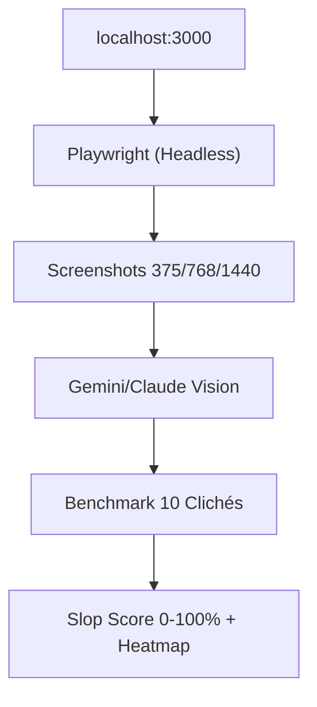

# UI-Slop_Bot

> Auditor visual de **UI Slop** — detecta patrones genéricos de IA (gradientes violeta, glassmorphism abusivo, heroes vacíos) analizando **píxeles renderizados**, no código. Supera el enfoque estático de `impeccable.style` con visión multimodal + heatmaps.

📄 **Contexto completo:** Ver [`CONTEXTO.md`](./CONTEXTO.md) — síntesis de la charla original en `AntigravityBrain/02_Aprendizajes/bot-detector-ui-slop.md` (2026-09-17) y hallazgos de `.gemini/antigravity/conversations`.

## Arquitectura MVP



## 10 Clichés que detecta

Gradientes púrpura sin marca, pricing 3-cards con "Popular", heroes vacíos, glassmorphism (`backdrop-blur-xl`), `rounded-2xl` everywhere, sombras `shadow-xl`, animaciones 700ms, baja legibilidad, sin estados empty/error.

## Estado

🚧 En diseño — ver `CONTEXTO.md` para roadmap y trade-offs (latencia 10-25s, costo ~$0.03/corrida).

## Próximo comando

```bash
npx ui-slop-bot audit --url http://localhost:3000
```
